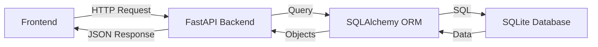

# Relatório Técnico - Giulia_Vendas

## Arquitetura



**Fluxo:**
1. Usuário faz requisição (ex: adicionar produto, buscar lista).
2. Frontend envia requisição para API FastAPI.
3. FastAPI processa, valida, usa SQLite para persistência.
4. Resposta JSON é devolvida ao frontend.

## Tecnologias e Versões

### Backend
- Python 3.11+
- FastAPI (framework web)
- Pydantic (validação de dados)
- SQLite (banco de dados)
- Faker (geração de dados de teste)
- Uvicorn (servidor ASGI)

### Frontend
- HTML5
- CSS3 (com variáveis CSS e flexbox)
- JavaScript ES6+
- Google Fonts (Outfit)

### Extensões VS Code Utilizadas
- Python
- Thunder Client (teste de API)
- GitHub Copilot
- SQLite Viewer
- Live Server

### Sugestões do Copilot
O Copilot contribuiu significativamente com:
- Estrutura do modelo Pydantic com validações
- Implementação de endpoints RESTful
- Geração de dados realistas com Faker
- Melhorias de acessibilidade
- Implementação de filtros dinâmicos
- Gestão de estado do carrinho

## Prompts do Copilot e Implementações

1. **Geração de Modelos**
   ```
   Prompt: "crie um modelo de produto com validações"
   Resultado: Implementação do modelo Pydantic com validadores
   ```
   ```python
   class Produto(BaseModel):
       nome: str = Field(..., min_length=3, max_length=60)
       preco: float = Field(..., gt=0)
       estoque: int = Field(..., ge=0)
   ```

2. **Filtros Frontend**
   ```
   Prompt: "implemente filtro dinâmico de produtos"
   Resultado: Sistema de filtros com debounce e múltiplos critérios
   ```

3. **Validações Backend**
   ```
   Prompt: "adicione validações para o pedido"
   Resultado: Validações customizadas com Pydantic
   ```

4. **Acessibilidade**
   ```
   Prompt: "melhore a acessibilidade do catálogo"
   Resultado: Implementação de ARIA labels e navegação por teclado
   ```

5. **Testes de API**
   ```
   Prompt: "gere testes para os endpoints"
   Resultado: Arquivo testes.http com casos de teste
   ```

6. **Melhorias Visuais**
   ```
   Prompt: "melhore o design do sistema"
   Resultado: Implementação de feedback visual e animações
   ```

## Peculiaridades Implementadas

1. **Sistema de Descontos**
   - Cupom "ALUNO10" com 10% de desconto
   - Validação no backend e frontend
   - Feedback visual imediato

2. **Filtros Avançados**
   - Busca por nome
   - Filtro por categoria
   - Range de preços
   - Disponibilidade em estoque
   - Atualização em tempo real

3. **Persistência de Estado**
   - Carrinho salvo em localStorage
   - Preferências de ordenação mantidas
   - Última busca recordada

## Validações

### Frontend
```javascript
// Exemplo de validação de produto
function validarProduto(produto) {
    if (!produto.nome || produto.nome.length < 3) return false;
    if (produto.preco <= 0) return false;
    if (produto.estoque < 0) return false;
    return true;
}
```

### Backend
```python
# Validações com Pydantic
class Produto(BaseModel):
    nome: str = Field(..., min_length=3, max_length=60)
    preco: float = Field(..., gt=0)
    estoque: int = Field(..., ge=0)
```

## Acessibilidade

1. **Semântica HTML**
   - Uso apropriado de tags (nav, main, section)
   - Estrutura hierárquica de headings

2. **ARIA Labels**
   - Botões e controles devidamente rotulados
   - Descrições para imagens e ícones

3. **Navegação**
   - Suporte completo a teclado
   - Skip links implementados
   - Ordem de tabulação lógica

4. **Visual**
   - Contraste adequado
   - Feedback visual claro
   - Tamanhos de fonte responsivos

## Como Rodar o Projeto

1. **Preparar Ambiente**
   ```bash
   # Clonar repositório
   git clone https://github.com/giucei/Giulia_Vendas
   cd Giulia_Vendas

   # Criar ambiente virtual
   python -m venv venv
   .\venv\Scripts\activate  # Windows
   
   # Instalar dependências
   pip install -r backend/requirements.txt
   ```

2. **Configurar Banco**
   ```bash
   python backend/database.py
   python backend/seed.py
   ```

3. **Iniciar Backend**
   ```bash
   uvicorn backend.app:app --reload
   ```

4. **Iniciar Frontend**
   - Abrir `frontend/index.html` com Live Server
   - Ou usar: `python -m http.server` na pasta frontend

[Adicionar screenshots do sistema em funcionamento aqui]

## Limitações e Melhorias Futuras

### Limitações Atuais
- Sem sistema de autenticação
- Gerenciamento básico de estoque
- Sem processamento real de pagamentos
- Imagens estáticas apenas

### Melhorias Planejadas
1. **Autenticação**
   - Implementar JWT
   - Níveis de acesso (admin/cliente)

2. **Gestão**
   - Sistema de estoque avançado
   - Dashboard administrativo
   - Relatórios de vendas

3. **UX/UI**
   - Modo escuro
   - Interface responsiva
   - Mais feedback visual

4. **Técnico**
   - Testes automatizados
   - CI/CD pipeline
   - Cache de consultas
   - Dockerização

5. **Funcionalidades**
   - Sistema de avaliações
   - Histórico de pedidos
   - Integração com pagamentos
   - Export de dados
